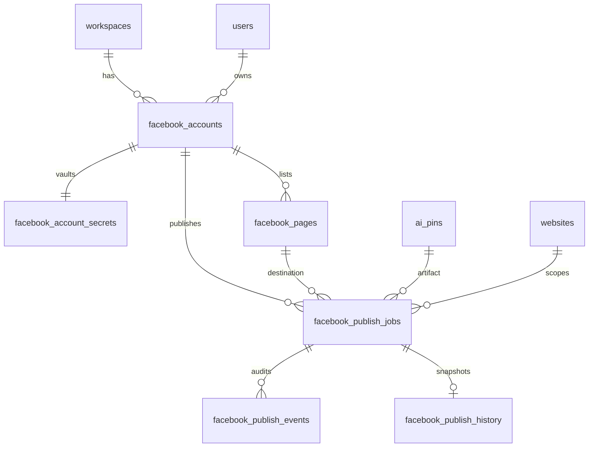

# Facebook Channel Pack — Schema & Feature Catalog (F1)

**Status:** Phase **F1-Apply** complete — collections + catalog + permissions registered.  
**ADR:** [facebook-channel-pack-architecture.md](./facebook-channel-pack-architecture.md) (`ADR-FB-CHANNEL-PACK-001`)  
**Last updated:** 2026-07-30  

**Applied in F1-Apply:** PocketBase migration `1785400000_facebook_channel_pack.js`, feature catalog `facebook`, workspace RBAC caps, publishing job map, channel-pack registry.  

**Still not implemented:** OAuth, Graph API, publishing, queue workers, Content Studio behavior changes, Calendar redesign.

Related: [database-schema.md](./database-schema.md) · [calendar-architecture.md](./calendar-architecture.md) · [api-contracts.md](./api-contracts.md)

---

## Architecture verification (F1)

| Constraint | Verified |
|------------|----------|
| Option A — shared `ai_pins` | **Yes** — no `ai_pins` field redesign in F1; jobs link via relation |
| Single Content Studio | **Yes** — schema does not require studio fork |
| Channel pack SoT | **Yes** — `facebook_publish_jobs` is write SoT |
| Unified Calendar | **Yes** — fields align with existing `mapFacebookJobToScheduledItem` / mutation adapter |
| Pinterest unchanged | **Yes** — new `facebook_*` collections only; no edits to `pinterest_*` |
| No OAuth / publish in F1 | **Yes** — collections empty-capable; Calendar source already `[]`-safe |

---

## 1. PocketBase collections

| Collection | Purpose | Parallel |
|------------|---------|----------|
| `facebook_accounts` | Connected Meta user metadata (non-secret) | `pinterest_accounts` |
| `facebook_account_secrets` | Encrypted user/page tokens | `pinterest_account_secrets` |
| `facebook_pages` | Publish destinations (Pages) | `pinterest_boards` |
| `facebook_oauth_states` | OAuth CSRF / state (F2) | `pinterest_oauth_states` |
| `facebook_publish_jobs` | **Write SoT** schedule/publish | `pinterest_publish_jobs` |
| `facebook_publish_events` | Job audit trail | `pinterest_publish_events` |
| `facebook_publish_history` | Denormalized published history / Insights snapshot | `pinterest_publish_history` |

**Not created in F1 design as separate collections**

| Idea | Decision |
|------|----------|
| `facebook_posts` studio store | Rejected (Option A — use `ai_pins`) |
| Alter `ai_pins` columns | Deferred — optional channel hint only if a later phase proves need |
| Reuse `pinterest_*` | Forbidden |

---

## 2. Collection fields

Conventions: every tenant collection includes `owner` (relation → `users`, required) and `workspace` (relation → `workspaces`, required for isolation). PocketBase also provides `id`, `created`, `updated`.

### 2.1 `facebook_accounts`

| Field | Type | Required | Notes |
|-------|------|----------|-------|
| `owner` | relation → users | yes | Cascade policy: restrict delete via API |
| `workspace` | relation → workspaces | yes | Workspace isolation |
| `facebook_user_id` | text ≤ 120 | yes | Meta user id |
| `username` | text ≤ 255 | | Display / Graph name |
| `label` | text ≤ 255 | | User-facing rename |
| `account_name` | text ≤ 255 | | Denormalized |
| `profile_image_url` | text ≤ 1000 | | |
| `scope` | text ≤ 2000 | | Granted scopes string |
| `connected` | bool | | |
| `status` | select | | `connected` \| `expired` \| `error` \| `disconnected` |
| `status_error` | text ≤ 2000 | | |
| `token_expires_at` | date | | User token expiry (metadata) |
| `last_sync_at` | date | | Last pages sync |
| `connected_at` | date | | |
| `is_default` | bool | | Default account in workspace |
| `oauth_app_id` | text ≤ 200 | | Which Meta app issued tokens |
| `workspace_key` | text ≤ 120 | | Legacy/compat mirror if needed (optional) |

**Secrets never stored here** (even if Pinterest historically had token columns — Facebook design keeps tokens only in `facebook_account_secrets`).

### 2.2 `facebook_account_secrets`

| Field | Type | Required | Notes |
|-------|------|----------|-------|
| `owner` | relation → users | yes | |
| `workspace` | relation → workspaces | yes | |
| `account` | relation → facebook_accounts | yes | `cascadeDelete: true` |
| `access_token` | text ≤ 4000 | | Encrypted at rest via app crypto (same pattern as Pinterest) |
| `refresh_token` | text ≤ 4000 | | If issued |
| `page_tokens` | json ≤ 200000 | | Map of `page_id → encrypted page access token` (optional structure) |

API list/detail for Hub **must omit** this collection entirely from client responses.

### 2.3 `facebook_pages`

| Field | Type | Required | Notes |
|-------|------|----------|-------|
| `owner` | relation → users | yes | |
| `workspace` | relation → workspaces | yes | |
| `account` | relation → facebook_accounts | yes | `cascadeDelete: true` |
| `page_id` | text ≤ 120 | yes | Meta Page id |
| `name` | text ≤ 300 | yes | |
| `category` | text ≤ 200 | | |
| `thumbnail_url` | text ≤ 1000 | | |
| `fan_count` | number | | Optional cache |
| `tasks` | json ≤ 50000 | | Page tasks/permissions snapshot |
| `is_default` | bool | | Default destination for account |
| `websiteId` | relation → websites | | Optional bind to Active Website |
| `connected` | bool | | Page usable for publish |

### 2.4 `facebook_oauth_states`

| Field | Type | Required | Notes |
|-------|------|----------|-------|
| `owner` | relation → users | yes | |
| `workspace` | relation → workspaces | yes | |
| `state` | text ≤ 200 | yes | CSRF nonce |
| `expires_at` | date | yes | |
| `used` | bool | | |
| `return_path` | text ≤ 500 | | Post-OAuth redirect inside app |
| `websiteId` | relation → websites | | Setup-mode website |

### 2.5 `facebook_publish_jobs` (Calendar write SoT)

Aligned with existing Calendar mapper (`title` / `message` / `caption`, `page_id`, `facebook_post_*`, `ai_pin`, `performance`, claim fields).

| Field | Type | Required | Notes |
|-------|------|----------|-------|
| `owner` | relation → users | yes | |
| `workspace` | relation → workspaces | yes | |
| `ai_pin` | relation → ai_pins | yes | Option A studio artifact (`cascadeDelete: true`) |
| `account` | relation → facebook_accounts | yes | |
| `page` | relation → facebook_pages | | Preferred relation; may be empty if denormalized only |
| `page_id` | text ≤ 120 | yes | Meta Page id (denormalized; Calendar / worker) |
| `page_name` / `page_label` | text ≤ 300 | | Denormalized label |
| `websiteId` | relation → websites | | |
| `articleId` | relation → website_articles | | |
| `title` | text ≤ 500 | | |
| `message` | text ≤ 5000 | | Primary post body |
| `caption` | text ≤ 2000 | | Alias/support field for mapper |
| `image_url` | text ≤ 2000 | | Media URL at enqueue time |
| `destination_url` | text ≤ 2000 | | Link attachment / CTA URL |
| `scheduled_at` | date | yes | App-side schedule (UTC instant) |
| `timezone` | text ≤ 80 | | |
| `scheduled_timezone` | text ≤ 80 | | Alias for Calendar mutations |
| `status` | select | yes | See §5 |
| `attempt_count` | number 0–100 | | |
| `max_attempts` | number 1–100 | | Default 3 |
| `next_retry_at` | date | | |
| `last_error` | text ≤ 3000 | | |
| `raw_api_error` | json ≤ 100000 | | Optional Graph error blob |
| `facebook_post_id` | text ≤ 120 | | |
| `facebook_post_url` | text ≤ 1000 | | |
| `published_at` | date | | |
| `performance` | json ≤ 100000 | | Insights snapshot |
| `analytics_synced_at` | date | | |
| `claim_token` | text ≤ 120 | | Worker CAS |
| `claim_version` | number | | Worker CAS |
| `account_label` | text ≤ 255 | | Denormalized for Calendar deepLinks |

**Status values (select):**  
`scheduled` | `publishing` | `published` | `failed` | `cancelled`  

(Same set as Pinterest jobs for Calendar / mutation parity. Publishing-history read model may map these into its broader enum including `queued` / `retrying` without requiring extra PB values in v1.)

### 2.6 `facebook_publish_events`

| Field | Type | Required | Notes |
|-------|------|----------|-------|
| `owner` | relation → users | yes | |
| `workspace` | relation → workspaces | yes | |
| `job` | relation → facebook_publish_jobs | yes | `cascadeDelete: true` |
| `event_type` | text ≤ 80 | yes | e.g. `created`, `claimed`, `published`, `failed`, `cancelled`, `rescheduled` |
| `message` | text ≤ 2000 | | |
| `payload` | json ≤ 100000 | | Redact tokens |

### 2.7 `facebook_publish_history`

| Field | Type | Required | Notes |
|-------|------|----------|-------|
| `owner` | relation → users | yes | |
| `workspace` | relation → workspaces | yes | |
| `job` | relation → facebook_publish_jobs | | |
| `ai_pin` | relation → ai_pins | | |
| `account` | relation → facebook_accounts | | |
| `page_id` | text ≤ 120 | | |
| `page_name` | text ≤ 300 | | |
| `facebook_post_id` | text ≤ 120 | | |
| `facebook_post_url` | text ≤ 1000 | | |
| `title` | text ≤ 500 | | |
| `message` | text ≤ 2000 | | Truncated snapshot |
| `image_url` | text ≤ 2000 | | |
| `published_at` | date | | |
| `performance` | json ≤ 100000 | | |
| `websiteId` | relation → websites | | |

---

## 3. Relationships

```
workspaces 1──* facebook_accounts 1──1 facebook_account_secrets
                      │
                      └──1──* facebook_pages
                      │
                      └──1──* facebook_publish_jobs *──1 ai_pins
                                   │         │
                                   │         └──* facebook_publish_events
                                   └── (optional) facebook_publish_history

users 1──* (all facebook_* via owner)
websites 0..1──* facebook_pages / facebook_publish_jobs
```

### ER diagram (logical)



### Calendar contract mapping

| Scheduled Item / deepLink | Job field |
|---------------------------|-----------|
| `refType` | constant `facebook_publish_jobs` |
| `refId` | job `id` |
| `scheduledAt` | `scheduled_at` |
| `timezone` | `scheduled_timezone` or `timezone` |
| `title` | `title` \|\| `message` \|\| `caption` |
| `previewUrl` | `image_url` \|\| `facebook_post_url` |
| `deepLinks.pageId` | `page_id` |
| `deepLinks.facebookPostId` | `facebook_post_id` |
| `deepLinks.studioPinId` | `ai_pin` |
| `deepLinks.liveUrl` | `facebook_post_url` |
| `performance` | `performance` |

No Calendar facade changes required.

---

## 4. Indexes

| Collection | Index | Purpose |
|------------|-------|---------|
| `facebook_accounts` | UNIQUE `(workspace, facebook_user_id)` | One Meta user per workspace |
| `facebook_accounts` | `(workspace)`, `(owner)`, `(connected)` | List/filter |
| `facebook_account_secrets` | UNIQUE `(account)` | 1:1 vault |
| `facebook_account_secrets` | `(workspace)`, `(owner)` | Isolation |
| `facebook_pages` | UNIQUE `(workspace, page_id)` | Stable Page identity |
| `facebook_pages` | `(account)`, `(workspace)` | Sync/list |
| `facebook_oauth_states` | UNIQUE `(state)` | CSRF lookup |
| `facebook_oauth_states` | `(owner, expires_at)` | Cleanup |
| `facebook_publish_jobs` | `(status, scheduled_at)` | Worker due query |
| `facebook_publish_jobs` | `(workspace, status)` | Tenant queues |
| `facebook_publish_jobs` | `(owner, status)` | Legacy owner filters |
| `facebook_publish_jobs` | `(next_retry_at)` | Retries |
| `facebook_publish_jobs` | `(ai_pin)` | Studio linkage |
| `facebook_publish_jobs` | `(page_id)`, `(account)` | Destination filters |
| `facebook_publish_events` | `(job)`, `(workspace, created)` | Trail |
| `facebook_publish_history` | `(workspace, published_at)`, `(facebook_post_id)` | History UI |

Also add workspace isolation SQL indexes consistent with `idx_isolation_*` pattern used for Pinterest.

---

## 5. Validation rules

### Schema-level

- Required fields as in §2.
- `status` enum closed set (§2.5).
- `account.status` enum closed set (§2.1).
- Text max lengths enforced.
- `ai_pin`, `account`, `page_id`, `scheduled_at` required on job create (API layer F4+).

### API-level (design; implement F2+)

| Rule | Enforcement |
|------|-------------|
| Workspace scope on every query/mutation | `andWorkspaceScope` / isolation rules |
| Owner must match workspace membership | Auth middleware |
| Secrets never in JSON responses | Route mappers omit collection |
| OAuth state single-use + expiry | F2 |
| Page must belong to same account + workspace | F3/F4 |
| Studio artifact `ai_pin` must be workspace-scoped | F4 |
| Reschedule only when `status = scheduled` | Already in Calendar mutation adapter |
| Cancel / retry status transitions | Mirror Pinterest adapter semantics |
| No dual-write of schedules into `calendar_events` | Architecture lock |
| Message/caption size within Graph limits | F3 validators (channel pack) |

### PocketBase API rules (design)

| Collection | Client rule intent |
|------------|-------------------|
| `facebook_account_secrets` | **API-only** — deny all user SDK access |
| `facebook_oauth_states` | **API-only** |
| Other `facebook_*` | Prefer **API-only** (same as hardened Pinterest path) — web uses `/facebook/*` only |

---

## 6. Feature flags

| Key | Layer | Default when absent | Notes |
|-----|-------|---------------------|-------|
| `facebook` | Plan `features` + feature catalog | **Denied** once catalog entry exists | Product gate for AI Facebook Pages + Hub |
| `AI_FACEBOOK_PAGES_PRODUCT.featureFlag` | Web product config | Already `'facebook'` | Must match catalog key |
| Env kill-switch (optional later) | `FACEBOOK_CHANNEL_ENABLED` | unset = follow plan | Not required in F1 |

**Today’s debt:** web `isFeatureEnabled('facebook', true)` defaults ON because catalog lacks `facebook`. F1 design closes this by defining the catalog entry; **code apply is post-F1**.

No separate `facebook.oauth` / `facebook.publish` plan keys in v1 — capabilities are gated by `facebook` + phase readiness (APIs present). Reserved subkeys may be added in F8 if plans need finer SKUs.

---

## 7. Channel capabilities

| Capability | Channel pack | Phase | Catalog gate |
|------------|--------------|-------|--------------|
| Connect Meta account | Yes | F2 | `facebook` |
| List / sync Pages | Yes | F2–F3 | `facebook` |
| Validate post payload | Yes | F3 | `facebook` |
| Publish now | Yes | F4 | `facebook` |
| Schedule (app-side) | Yes | F5 | `facebook` |
| Calendar project / mutate | Provider exists | F5 verify | `calendar` + `facebook` |
| Insights sync | Yes | F7 | `facebook` + `analytics` |
| Publishing history row | Yes | F7 | `facebook` + `history` |
| Generate image/copy | Shared AI Pins | — | `aiImages` / `aiWriter` (not `facebook`) |
| Templates / brand kit | Shared | — | existing template/brand keys |

**Publishing job collection map (design):**

```js
// services/publishing-history/constants.js — apply post-F1
PUBLISHING_JOB_COLLECTIONS = {
  pinterest: 'pinterest_publish_jobs',
  wordpress: 'publish_jobs',
  facebook: 'facebook_publish_jobs', // ADD
}
```

---

## 8. Permissions model

| Actor | Allowed |
|-------|---------|
| Workspace member (read) | List accounts/pages/jobs/history via `/facebook/*` when plan has `facebook` |
| Workspace member (write) | Connect, set default, publish/schedule when plan has `facebook` |
| Workspace admin/owner | Disconnect, revoke, manage defaults |
| Platform admin | App credentials, incident tooling — not user Page tokens in cleartext |
| Anonymous | None |
| PB JS SDK direct | Denied for secrets/oauth; prefer deny-all for facebook_* |

Workspace isolation: every row carries `workspace`; API filters mandatory. Same inventory treatment as Pinterest in isolation phase scripts (**design note for F1 apply**).

---

## 9. Data lifecycle

```
F2  OAuth success → facebook_accounts + secrets + oauth_states(used)
      → pages sync → facebook_pages

F3  Studio lists accounts/pages (read)

F4  Publish now → facebook_publish_jobs(status=scheduled|publishing)
      → events → worker → Graph → published|failed
      → optional history row; ai_pins.publish_job_id / status update (channel fields on ai_pins only as needed — no F1 schema change)

F5  Schedule → jobs with future scheduled_at
      → Calendar lists via provider
      → reschedule/cancel/retry via mutation adapter

F7  Insights → performance + analytics_synced_at + history update

Disconnect → mark account disconnected; revoke secrets; cancel scheduled jobs (policy: cancel vs leave — default cancel scheduled)
Delete account → cascade pages + secrets; jobs: restrict or null account (prefer cancel scheduled then soft-retain published jobs)
Delete ai_pin → cascadeDelete jobs (same as Pinterest)
```

Retention: events retained with job; history retained for analytics; oauth_states TTL delete after expiry.

---

## 10. Migration plan

### F1 design (this document) — done

No files written under `apps/pocketbase/pb_migrations/`.

### F1-apply (future approval — still before OAuth product work)

Single (or ordered) committed migration(s), e.g.:

1. `*_facebook_channel_pack_collections.js` — create all seven collections + indexes.
2. `*_facebook_channel_pack_api_rules.js` — API-only rules + workspace isolation list updates.
3. Code (still not OAuth): `feature-catalog.js` add `facebook`; `PUBLISHING_JOB_COLLECTIONS.facebook`; isolation inventory arrays.

**Rules**

- Do not modify `pinterest_*` migrations or collections.
- Do not alter `ai_pins` schema in the same change set unless a proven field is required (default: **do not**).
- Do not apply untracked local migrations in production.
- Calendar providers already tolerate missing collection → `[]`; after migration, empty tables remain valid.

### Rollback

Delete `facebook_*` collections only if no production rows; otherwise disable feature flag `facebook` and leave tables.

---

## 11. API contracts (design only)

Mount (future): `/facebook` — auth + workspace + plan feature `facebook`.

| Method | Path | Phase | Purpose |
|--------|------|-------|---------|
| POST | `/facebook/oauth/start` | F2 | Start OAuth |
| GET/POST | `/facebook/oauth/callback` | F2 | Complete OAuth |
| GET | `/facebook/accounts` | F2 | `filter=active\|connected` |
| PATCH | `/facebook/accounts/:id` | F2 | Label |
| POST | `/facebook/accounts/:id/default` | F2 | Default account |
| POST | `/facebook/accounts/:id/disconnect` | F2 | Disconnect |
| POST | `/facebook/accounts/:id/reconnect` | F2 | Re-OAuth |
| GET | `/facebook/pages` | F2–F3 | `accountId` |
| POST | `/facebook/pages/sync` | F2 | Sync Pages |
| POST | `/facebook/accounts/:id/pages/:pageId/default` | F3 | Default Page |
| POST | `/facebook/publish` | F4 | Publish now |
| POST | `/facebook/schedule` | F5 | Schedule |
| GET | `/facebook/jobs` | F4 | List/poll |
| PATCH | `/facebook/jobs/:id` | F5 | Reschedule (also via Calendar) |
| POST | `/facebook/jobs/:id/cancel` | F5 | Cancel |
| POST | `/facebook/jobs/:id/retry` | F5 | Retry |
| GET | `/facebook/history` | F7 | Channel history |
| GET | `/facebook/analytics` | F7 | Insights rollup |

**DTO shapes (illustrative)**

Account (public): `{ id, facebookUserId, username, label, connected, status, isDefault, lastSyncAt }` — **no tokens**.

Page: `{ id, pageId, name, isDefault, accountId, thumbnailUrl }`.

Job: `{ id, status, scheduledAt, timezone, pageId, pageName, aiPinId, facebookPostId, facebookPostUrl, lastError, attemptCount, performance }`.

Studio continues to call `/ai-pins/*` for generation (unchanged).

Do **not** edit `docs/api-contracts.md` live routes until F2+ implements them; this section is the contract draft.

---

## 12. Feature catalog (design)

Add to `FEATURE_CATALOG` (code apply post-F1):

```js
{
  key: 'facebook',
  label: 'Facebook',
  group: 'core',
  description: 'Connect Facebook Pages and publish/schedule posts from Content Studio.',
  stage: 'reserved', // flip to 'ga' when F2 Hub is customer-ready; or 'ga' + plan deny by default
  dependencies: [],
  defaultVisibleWhenLocked: true,
}
```

### Plan mapping guidance

| Plan | Suggested `facebook` |
|------|----------------------|
| Free | deny |
| Starter+ | allow (product decision) |
| Agency | allow |

Exact plan JSON updates are **out of F1** (no code). Until catalog+plans are applied, treat Hub as non-production.

### Compatibility with web product

`AI_FACEBOOK_PAGES_PRODUCT.featureFlag === 'facebook'` — already correct; needs catalog key to stop default-ON.

---

## 13. Risks and compatibility notes

| ID | Note | Mitigation |
|----|------|------------|
| C1 | Creating collections without API-only rules could expose secrets if SDK used | Ship rules with collections; secrets never selected in routes |
| C2 | `ai_pin` required couples FB jobs to Pin-named collection | Option A accepted; F8 rename optional |
| C3 | Calendar mapper accepts `page` expand vs `page_id` text | Store both; mapper already handles |
| C4 | Publishing-history lists `facebook` without collection map | Add map when collections exist; until then history stays empty for FB |
| C5 | Platform analytics `facebook: 0` | Remains until F7 |
| C6 | Unique `(workspace, facebook_user_id)` vs multi-BM | One Meta user identity per workspace v1; multiple Pages under it |
| C7 | Page tokens in `page_tokens` json vs rows | json map OK for v1; revisit if rotation complexity grows |
| C8 | Accidental Pinterest schema edits | Migration must only touch `facebook_*` |
| C9 | Content Studio behavior | No product/config changes in F1 |
| C10 | Empty tables after migrate | Calendar + adapter stubs remain safe |

---

## Deliverables checklist (F1)

| Deliverable | Location |
|-------------|----------|
| Database schema document | **This file** |
| ER diagram | §3 mermaid |
| Feature catalog design | §12 |
| Migration strategy | §10 |
| Architecture verification | Top + §13 |
| API contracts (design) | §11 |
| ADR phase lock update | `facebook-channel-pack-architecture.md` |
| `database-schema.md` pointer | Short related note |

---

## Explicit stop

**Stop after F1 design.**  
Do not create PocketBase migrations, do not edit `feature-catalog.js`, do not implement OAuth/publishing, do not commit — until a separate approval to **apply** schema/catalog and/or start **F2**.
