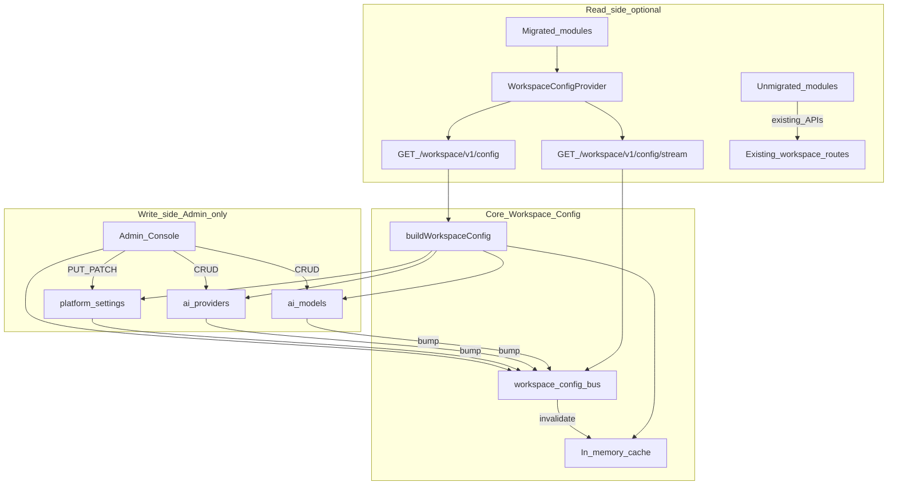
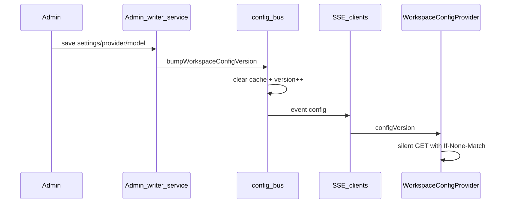

# Workspace Config Platform

Core platform service that delivers a **secret-safe, versioned, workspace-scoped** configuration DTO to product modules. Admin Console is the only writer; modules are read-only consumers.

**Phase 1 status:** API + provider shipped. Consumption is **optional** — unmigrated modules keep their existing endpoints and local logic with no regressions.

## Locked platform laws

1. Versioned & backward-compatible API under `/workspace/v1/config` (additive fields only; breaking changes require `/v2`).
2. Never expose Admin secrets (API keys, ciphertext, passwords, OAuth secrets) to the frontend.
3. Every config item carries provenance: `version`, `updated_at`, `source`, `workspace_id`.
4. Feature flags are first-class in every payload.
5. Server cache invalidates automatically after Admin writes.
6. Frontend never blocks on background reload (stale-while-revalidate).
7. Missing sections degrade to safe defaults; modules must not crash.
8. New modules must use `useWorkspaceConfig()` only — no parallel platform config APIs.
9. This document is the architecture source of truth.
10. This is a **core platform service**, not an AI Pins feature.

## Architecture



### Hot reload



## HTTP API (additive)

| Method | Path | Notes |
|--------|------|-------|
| GET | `/workspace/v1/config` | Full secret-safe DTO. Supports `?since=` and `If-None-Match` → **304**. Sets `ETag`. |
| GET | `/workspace/v1/config/stream` | SSE: `connected`, `config` events + heartbeats. |

Existing `/workspace/v1/*` routes are unchanged. Unmigrated modules continue calling dashboard, settings, credits, templates, etc.

## DTO envelope (stable `/v1`)

```text
{
  apiVersion: "v1",
  configVersion: "<monotonic>",
  updated_at: "<iso>",
  source: "platform" | "derived",
  workspace_id: "<id>",
  featureFlags: [ { id, label, enabled, version, updated_at, source, workspace_id } ],
  ai, images, content, pinterest, wordpress, security, prompts,
  textProviders, imageProviders, models, textModels, imageModels,
  credits, limits, brandKits, templates,
  publishingRules, schedulingDefaults, watermark, typographyHints, queueDefaults, general
}
```

Clients must tolerate unknown keys. Removals/renames require `/v2`.

## Security

Responses must never contain:

- `apiKey`, `secret`, `password`, `ciphertext`, `token`, `private_key` (any casing/underscore variant)
- Values starting with `enc:v1:` or masked `••••` secrets

Assembler runs `stripSecrets()` before cache + response.

## Caching & metrics

- In-process cache keyed by `workspace_id` (30s TTL safety net).
- Cleared on every `bumpWorkspaceConfigVersion(reason)`.
- Structured logs (`[workspace-config]`):
  - `config_version_change`
  - `cache_invalidation`
  - `sse_connect` / `sse_disconnect`
  - `config_rebuild` (durationMs, payloadBytes)
- Runtime metrics via `getWorkspaceConfigMetrics()`: assembly time, payload size, cache hit ratio, SSE counts.

## Frontend

| Piece | Path |
|-------|------|
| Provider | `apps/web/src/context/WorkspaceConfigContext.jsx` |
| Hook | `useWorkspaceConfig()` |
| Defaults | `apps/web/src/lib/workspaceConfigDefaults.js` |

Mounted inside authenticated `Shell` (`/app/*` only).

**Rollout-safe behavior:**

- Modules that do **not** call `useWorkspaceConfig()` behave exactly as before.
- Hook outside provider returns safe defaults (no throw).
- Background refresh never clears last valid config.
- Config fetch failure does not block page render.

```js
import { useWorkspaceConfig } from '@/context/WorkspaceConfigContext';

const { config, isFeatureEnabled, isRefreshing } = useWorkspaceConfig();
if (!isFeatureEnabled('ai-pins', true)) { /* disable UI */ }
```

## Admin invalidation hooks

`bumpWorkspaceConfigVersion` is called after successful writes in:

- `platform-settings.js` → `upsertPlatformSettings`
- `ai-providers.js` → create/update/secrets/enable/delete
- `ai-models.js` → create/update/enable/default/delete

## How to add a feature flag

1. Add `{ id, label, enabled }` to `DEFAULT_PLATFORM_SETTINGS.featureFlags` (and Admin settings UI when available).
2. Flag appears automatically in `/workspace/v1/config`.
3. Gate UI with `isFeatureEnabled('your-flag')`.

## Module migration checklist

**Completed:** AI Pins Studio (Phase 2) — uses `useWorkspaceConfig()` for providers, models, prompts, credits, flags, templates, brand kits, image/publishing settings, and limits.

See the full cutover inventory in [`docs/workspace-config-migration.md`](./workspace-config-migration.md).

Remaining modules (Writer, Images, publishers, Scheduler, Analytics, Brand Kit page, Templates page):

1. Replace hardcoded providers/models/prompts with `useWorkspaceConfig()`.
2. Remove duplicate local platform settings fetches for concerns already in the DTO.
3. Gate new surfaces with feature flags.
4. Keep existing action APIs (generate, publish, etc.) — only configuration reads move.
5. Verify module still works if config endpoint is slow/unavailable (defaults + last-valid).

## Versioning policy

- `/v1`: additive only.
- Breaking change: ship `/workspace/v2/config`, document migration, keep `/v1` until clients migrate.
